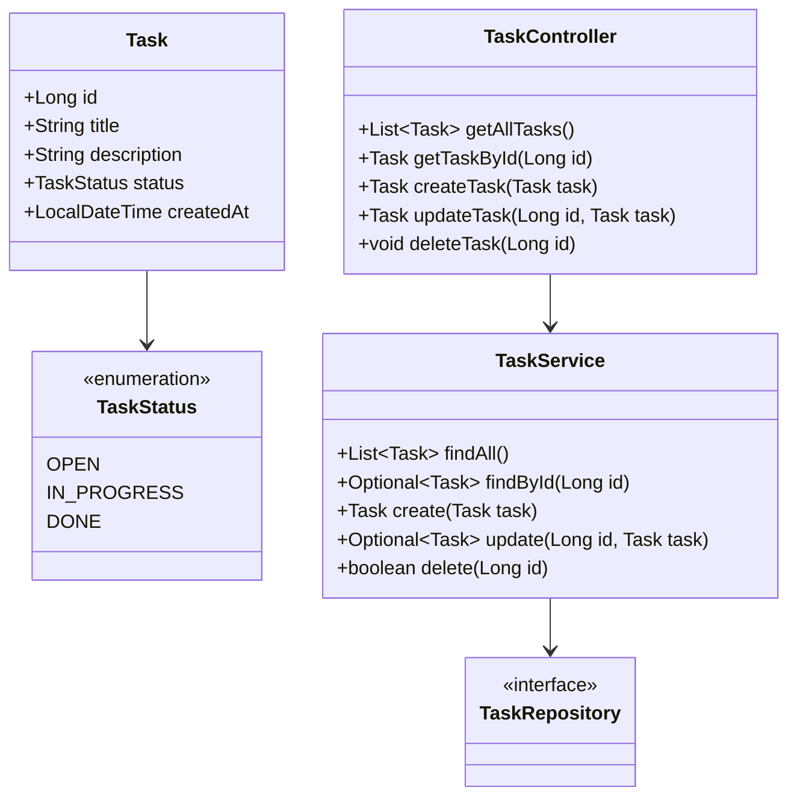
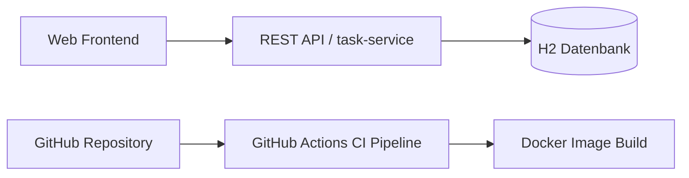

# Architektur- und Entwurfsdokumentation

## 1. Szenario der Webapplikation

Im Projekt wird eine einfache Webapplikation mit dem Namen **TaskBoard** umgesetzt. Die Anwendung dient der Verwaltung von Aufgaben. Benutzer können Aufgaben anlegen, anzeigen, bearbeiten und löschen. Dadurch werden die grundlegenden CRUD-Operationen vollständig unterstützt.

## 2. Fachliches Modell

Eine Aufgabe besitzt die Attribute:
- `id`
- `title`
- `description`
- `status`
- `createdAt`

Der Status einer Aufgabe wird durch die Ausprägungen `OPEN`, `IN_PROGRESS` und `DONE` beschrieben.

## 3. Objektorientiertes Klassenmodell

## 4. Microservice-Konzept

Die Webapplikation wird in einen fachlich klar abgegrenzten Microservice zerlegt: den **task-service**.

### Fachliche Verantwortung des task-service
- Verwaltung von Aufgaben
- Bereitstellung einer REST-Schnittstelle
- Speicherung der Aufgabendaten in einer persistenten Datenbank

### Begründung des Zuschnitts
Die Zerlegung orientiert sich an einem klaren fachlichen Kontext. Die Aufgabenverwaltung bildet einen eigenständigen **Bounded Context**, da alle zugehörigen Funktionen fachlich eng zusammengehören und unabhängig von anderen möglichen Domänen betrachtet werden können. Weitere Services wie Benutzerverwaltung oder Benachrichtigungen wären später separat ergänzbar.

## 5. Technologie-Stack

### Frontend
- HTML
- CSS
- JavaScript

### Backend / Microservice
- Java 21
- Spring Boot
- Spring Web
- Spring Data JPA
- H2-Datenbank
- Maven

### DevOps
- GitHub
- Docker
- GitHub Actions

## 6. Komponentendiagramm

## 7. REST-Kommunikation

Das Frontend kommuniziert über HTTP mit dem Microservice. Die REST-Schnittstelle ist so gestaltet, dass sowohl das Frontend als auch andere potenzielle Microservices dieselben Endpunkte nutzen könnten.

## 8. Persistenz

Die Daten werden dauerhaft in einer H2-Datenbank gespeichert. Damit ist die Anforderung eines persistenten Speichers erfüllt.

## 9. Qualitätssicherung

Zur Qualitätssicherung wurden folgende Maßnahmen vorgesehen beziehungsweise umgesetzt:
- strukturierte Schichtenarchitektur mit Controller, Service und Repository
- Validierung von Eingaben
- automatisierte Integrationstests für zentrale CRUD-Funktionen
- automatisierter Build- und Testlauf in GitHub Actions
- containerisierte Ausführung mittels Docker

## 10. Einordnung der CI/CD-Pipeline

Die Pipeline automatisiert bereits zentrale Continuous-Integration-Schritte:
- Auschecken des Repositorys
- Einrichten der Java-Umgebung
- Build des Backends
- Ausführung der Tests
- Build eines Docker-Images

Eine vollständige automatische Auslieferung auf eine Zielumgebung ist noch nicht umgesetzt. Damit liegt derzeit vor allem eine **CI-Pipeline mit CD-Vorbereitung** vor.
